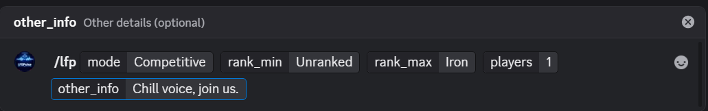
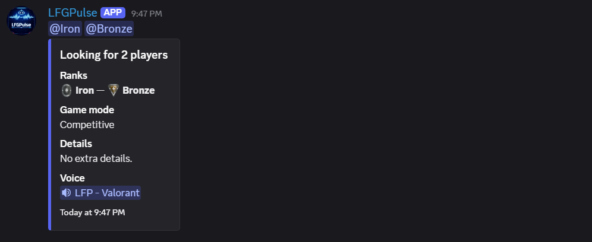
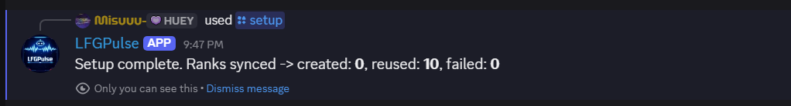

# Discord LFP Bot (Showcase)

A Discord bot designed to create clean **"Looking For Players"** posts with rank role pings, voice-channel context, optional custom rank emojis, and automatic post cleanup.

**Source code is private.**  
This repository exists as a **public showcase and overview** of the project.

If you are interested in this bot, feel free to contact me.

---

# Built With

- Node.js
- TypeScript
- discord.js
- Discord Slash Commands API

---

# What This Bot Does

- Creates structured LFP posts using `/lfp`
- Supports rank range selection (minimum and maximum rank)
- Automatically pings configured rank roles
- Requires the user to be in a voice channel before posting
- Stores server configuration and rank mappings
- Automatically removes expired LFP posts

---

# Main Commands

## `/setup`

Creates or syncs rank roles on the server.

Requires **administrator permissions**.

---

## `/config set_channel`

Sets the text channel where LFP posts will be sent.

Requires **administrator permissions**.

---

## `/config set_cleanup`

Sets the expiration time for LFP posts (in hours).

Requires **administrator permissions**.

---

## `/lfp`

Creates an LFP embed in the configured channel.

The embed includes:

- Game mode
- Rank range
- Number of players needed
- Optional details
- Voice channel reference

---

# LFP Post Format

Each `/lfp` post contains:

- Rank or rank range (example: **Gold → Diamond**)
- Game mode (Competitive, Unrated, Custom)
- Number of players needed
- Optional additional details
- Voice channel mention
- Rank role mentions (if configured)

---

# Emoji Support

The bot supports **Discord Application Emojis** through environment configuration.

`RANK_EMOJI_IDS` is defined as a JSON map of **rank → emoji ID**.

Example configuration:

    {
      "Unranked": "111111111111111111",
      "Iron": "222222222222222222",
      "Bronze": "333333333333333333",
      "Silver": "444444444444444444",
      "Gold": "555555555555555555",
      "Platinum": "666666666666666666",
      "Diamond": "777777777777777777",
      "Ascendant": "888888888888888888",
      "Immortal": "999999999999999999",
      "Radiant": "101010101010101010"
    }

If application emojis are used in posts, the bot requires the **Use External Emojis** permission in the target channel.

---

# Required Bot Permissions

- View Channels
- Send Messages
- Embed Links
- Mention Everyone (for role pings)
- Use External Emojis (when using application emojis)
- Manage Roles (for `/setup`)
- Read Message History (for cleanup)

---

# Setup Flow (Server Admin)

1. Invite the bot with the required permissions
2. Run `/setup`
3. Run `/config set_channel` and choose your LFP channel
4. Run `/config set_cleanup` (for example `2` hours)
5. Members can now use `/lfp` while connected to a voice channel

---

# Showcase

## LFP Command

---

## Generated LFP Post

---

## Setup Command Output

It shows that it used ranks because I already have them created. Yours will be created without any problem.

---

## TO DO:

Creating a dashboard that syncs with the Discord bot. When a message is posted in a Discord server, an LFP post will also be created on the website. Players will be able to see who created it, what ranks are required, etc., and have a "Join Discord" button to join the server directly where the LFP was posted. No ETA for this yet.

---

# Notes

This repository is intended as a **portfolio showcase**.

The production source code is kept private.